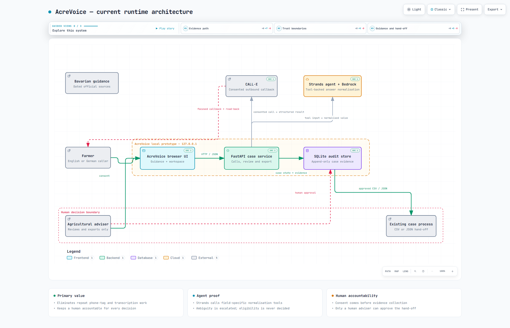

# AcreVoice

**Clear guidance. Human decisions. No lost paperwork.**

AcreVoice is a farmer-support workspace for finding public programme guidance, resolving missing case information by phone with consent, and handing a reviewable evidence package to a human adviser. It is designed for Bavarian agriculture services, with English and German support.



The adviser workspace includes an **Evidence Passport** for each missing fact:
source, question, spoken answer, confirmation, recorded value, and human next
step stay visible together. The local rehearsal also includes an explicit
uncertainty route that holds hedged answers rather than guessing.

## What it does

Farmers should not need to navigate a new portal just to answer one focused question. Advisers should not have to act on an untraceable note from a phone call. AcreVoice connects those needs:

1. **Find guidance.** A farmer or adviser starts with a support goal and sees dated links to relevant public sources.
2. **Request a callback.** The system asks for consent before any questions are collected by phone.
3. **Capture evidence.** It records the question, answer, read-back confirmation, timestamp, and outcome.
4. **Keep a person accountable.** An adviser can approve only exact, confirmed information; uncertainty is routed for follow-up.
5. **Export a hand-off.** A CSV or JSON package carries the evidence into the organisation's existing case process.

It does **not** decide eligibility, approve a subsidy, submit to a government system, or replace an adviser.

## The job the agent completes

Missing or unclear information creates a repetitive loop for an adviser: find the relevant programme guidance, contact the farmer, interpret a spoken answer, decide whether it is safe to use, and prepare a case note. AcreVoice takes on the repeatable coordination work while preserving the decision for a person.

For every support case, the system:

1. narrows the request to a small set of missing facts and links the relevant public guidance;
2. obtains callback consent and makes one focused CALL-E phone conversation;
3. asks, reads back, and captures every answer as structured evidence;
4. uses a Strands agent with field-specific tools to normalise the spoken response and identify ambiguity;
5. escalates uncertainty to an adviser instead of guessing; and
6. creates a reusable CSV or JSON hand-off when a human has reviewed the evidence.

This is deliberately not a generic voice bot. Its unit of work is an evidence-backed farmer-support case, and its safe stopping point is a human decision.

## End-to-end evidence trail

```text
Official source → consent → CALL-E conversation → Strands normalisation
               → confirmation and audit event → human review → export or expert routing
```

The call adapter makes one consented outbound call per case and receives a structured outcome. The Strands record agent uses purpose-built area and yes/no normalisation tools; deterministic guardrails reject hedged or unconfirmed values even when a model is unavailable. Every step is written to an append-only audit log, allowing an adviser to see why a value was proposed and why it was or was not eligible for approval.

## Built for people, not forms

The public-service home page explains the service, its sources, safeguards, and frequently asked questions before someone enters the workspace. The workspace then supports a focused case flow:

`source guidance → consented callback → evidence captured → human review → export or expert routing`

The adviser console can be English while a farmer receives a German call. Programme codes that remain in German are accompanied by an English explanation in the English interface.

## Data and trust boundaries

- **Official guidance, not an eligibility engine.** Source cards link to dated Bavarian government material. They describe potential relevance and always require human verification.
- **Synthetic example cases.** Holdings, field values, transcripts, and sample call outcomes in this repository are illustrative. They do not represent real farmers.
- **Evidence before action.** Unconfirmed, approximate, refused, unreachable, or partial answers cannot be applied automatically.
- **Local by default.** The web server binds to `127.0.0.1`; it has no authentication or tenant isolation and must not be exposed as a public service without production security controls.

## Run locally

No credentials are needed to test the deterministic local workflow. Phone calling remains a core product capability; configure CALL-E before presenting the end-to-end service with a real callback.

```bash
python3.14 -m venv .venv
./.venv/bin/pip install -e . -r requirements.txt
PYTHONPATH=src ./.venv/bin/python -m acrevoice
```

Adviser console at <http://127.0.0.1:8080>:

```bash
PYTHONPATH=src ./.venv/bin/python -m acrevoice web
```

Tests:

```bash
PYTHONPATH=src ./.venv/bin/python -m pytest tests -q
```

### Configure the connected service

Copy `.env.example` to `.env`. `CALLE_API_KEY` and a permitted test phone number are required to place a real callback. The local deterministic path is for development and automated tests only.

```bash
cp .env.example .env
./.venv/bin/python scripts/check_credentials.py   # verifies keys, consumes no calls
```

| Variable | Purpose |
|---|---|
| `CALLE_API_KEY` | Real outbound calls via CALL-E |
| `DEMO_PHONE_NUMBER` | Number to call, E.164 (e.g. `+4915112345678`) |
| `AWS_BEARER_TOKEN_BEDROCK` | Bedrock Projects key for the Strands agent |
| `MANTLE_MODEL_ID` | Default `google.gemma-4-31b` |

Then:

```bash
PYTHONPATH=src ./.venv/bin/python -m acrevoice --live
```

## Technology in the working path

| Layer | Role in AcreVoice |
| --- | --- |
| **[CALL-E](https://heycall-e.com/)** | Places the consented outbound callback and returns structured results the workflow can act on. |
| **[Strands Agents](https://strandsagents.com/docs/user-guide/quickstart/overview/)** | Runs the record agent and its field-specific normalisation tools, producing structured evidence rather than free-form notes. |
| **[Amazon Bedrock](https://docs.aws.amazon.com/bedrock/)** | Provides the configured model runtime for the Strands agent. |
| **FastAPI + SQLite** | Delivers the browser service, case workflow, export endpoints, and append-only audit trail. |

The repository includes both a deterministic development path and the connected runtime path. For an end-to-end run, configure CALL-E and Amazon Bedrock, start the service, create a support case, request a callback, then review and export the returned evidence.

## Public sources used in the product

- [Bavarian State Ministry food, agriculture, forestry and tourism: funding](https://www.stmelf.bayern.de/foerderung)
- [Bavarian 2025 Eco-schemes guidance (Öko-Regelungen)](https://www.stmelf.bayern.de/mam/cms01/agrarpolitik/dateien/merkblatt_oekoregelungen.pdf)
- [Bavarian 2025 multiple-application guidance (Mehrfachantrag)](https://www.stmelf.bayern.de/mam/cms01/agrarpolitik/dateien/m_mfa.pdf)

## Licence

MIT — see [LICENSE](LICENSE).
