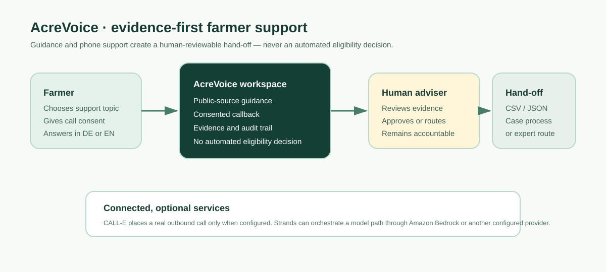

# AcreVoice

**Clear guidance. Human decisions. No lost paperwork.**

AcreVoice is a farmer-support workspace for finding public programme guidance, resolving missing case information by phone with consent, and handing a reviewable evidence package to a human adviser. It is designed for Bavarian agriculture services, with English and German support.



## What it does

Farmers should not need to navigate a new portal just to answer one focused question. Advisers should not have to act on an untraceable note from a phone call. AcreVoice connects those needs:

1. **Find guidance.** A farmer or adviser starts with a support goal and sees dated links to relevant public sources.
2. **Request a callback.** The system asks for consent before any questions are collected by phone.
3. **Capture evidence.** It records the question, answer, read-back confirmation, timestamp, and outcome.
4. **Keep a person accountable.** An adviser can approve only exact, confirmed information; uncertainty is routed for follow-up.
5. **Export a hand-off.** A CSV or JSON package carries the evidence into the organisation's existing case process.

It does **not** decide eligibility, approve a subsidy, submit to a government system, or replace an adviser.

## Built for people, not forms

The public-service home page explains the service, its sources, safeguards, and frequently asked questions before someone enters the workspace. The workspace then supports a focused case flow:

`source guidance → consented callback → evidence captured → human review → export or expert routing`

The adviser console can be English while a farmer receives a German call. Programme codes that remain in German are accompanied by an English explanation in the English interface.

## Data and trust boundaries

- **Official guidance, not an eligibility engine.** Source cards link to dated Bavarian government material. They describe potential relevance and always require human verification.
- **Synthetic example cases.** Holdings, field values, transcripts, and sample call outcomes in this repository are illustrative. They do not represent real farmers.
- **Evidence before action.** Unconfirmed, approximate, refused, unreachable, or partial answers cannot be applied automatically.
- **Local by default.** The web server binds to `127.0.0.1`; it has no authentication or tenant isolation and must not be exposed as a public service without production security controls.

## Run locally

No credentials are needed for the deterministic local workflow.

```bash
python3.14 -m venv .venv
./.venv/bin/pip install -e . -r requirements.txt
PYTHONPATH=src ./.venv/bin/python -m acrevoice
```

Adviser console at <http://127.0.0.1:8080>:

```bash
PYTHONPATH=src ./.venv/bin/python -m acrevoice web
```

Tests:

```bash
PYTHONPATH=src ./.venv/bin/python -m pytest tests -q
```

### Optional phone and model integrations

Copy `.env.example` to `.env` and fill in what you have. Every key is optional — without
them the demo runs on the deterministic provider and a deterministic policy.

```bash
cp .env.example .env
./.venv/bin/python scripts/check_credentials.py   # verifies keys, consumes no calls
```

| Variable | Purpose |
|---|---|
| `CALLE_API_KEY` | Real outbound calls via CALL-E |
| `DEMO_PHONE_NUMBER` | Number to call, E.164 (e.g. `+4915112345678`) |
| `AWS_BEARER_TOKEN_BEDROCK` | Bedrock Projects key for the Strands agent |
| `MANTLE_MODEL_ID` | Default `google.gemma-4-31b` |

Then:

```bash
PYTHONPATH=src ./.venv/bin/python -m acrevoice --live
```

## Technology

- **FastAPI and SQLite** provide a compact local web application and append-only audit store.
- **[CALL-E](https://heycall-e.com/)** is the optional outbound-call provider. Without its API key, AcreVoice uses deterministic simulated call outcomes.
- **[Strands Agents](https://strandsagents.com/docs/user-guide/quickstart/overview/)** orchestrates the optional language-model path. It can use **[Amazon Bedrock](https://docs.aws.amazon.com/bedrock/)**, which provides managed access to foundation models, or configured alternatives.

## Public sources used in the product

- [Bavarian State Ministry food, agriculture, forestry and tourism: funding](https://www.stmelf.bayern.de/foerderung)
- [Bavarian 2025 Eco-schemes guidance (Öko-Regelungen)](https://www.stmelf.bayern.de/mam/cms01/agrarpolitik/dateien/merkblatt_oekoregelungen.pdf)
- [Bavarian 2025 multiple-application guidance (Mehrfachantrag)](https://www.stmelf.bayern.de/mam/cms01/agrarpolitik/dateien/m_mfa.pdf)

## Licence

MIT — see [LICENSE](LICENSE).
